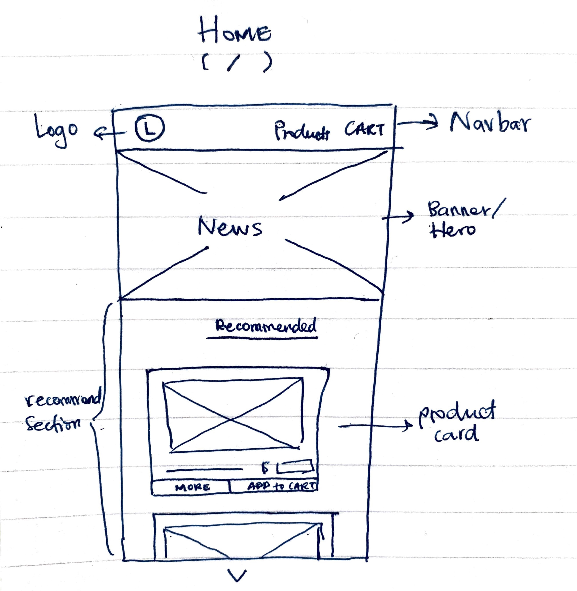
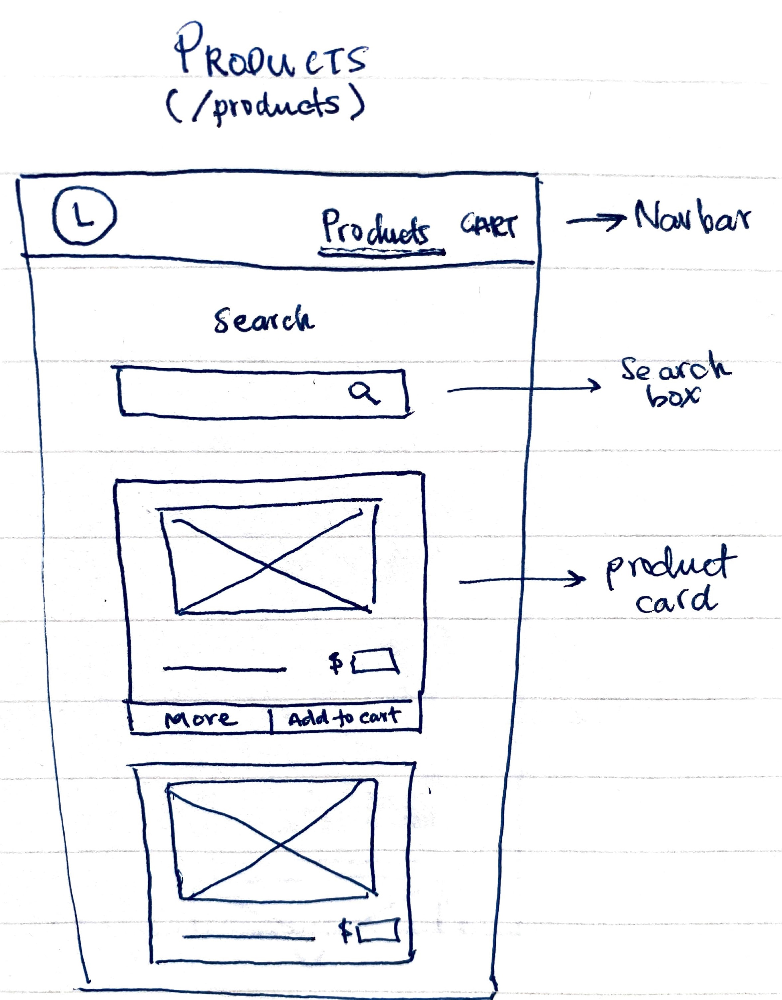
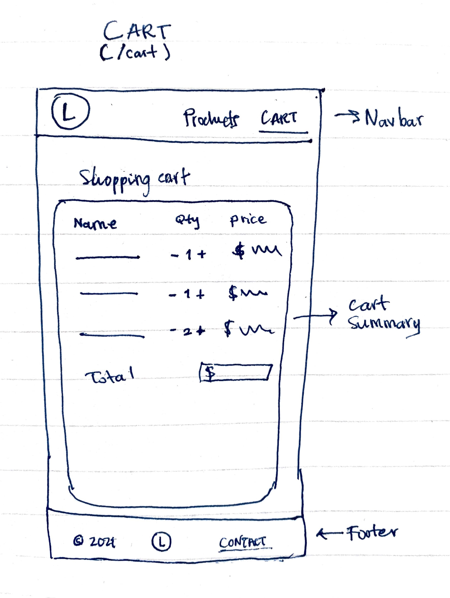

# Online-shop app

This e-commerce app was created using React framework.

## Motivation

The idea is to create a basic client-side e-commerce app making use of some user stories.

### User Stories

- As a **_customer_**, I should be able to **_see the available products_**
- As a **_customer_**, I should be able to **_search the available products_**
- As a **_customer_**, I should be able to **_add products to my shopping cart_**

## Process

### Wireframe

Wireframing the app was the first step. From here I can get details to feed in my kanban board.





Designed with a _"mobile first"_ approach. Making it easier to build on with responsiveness.

### Progress

Development steps making use of a kanban board. This helps me get an overview of the tasks at hand and keep track of the progress. the kanban board could be Trello or even better [Github projects](https://github.com/carlos-ch/online-shop/projects), which lets me have everything in one place and it's to add some automation to the workflow.

## Tech / Framework

Because of the size of this project, it's important for me to have a simple tech stack and use only what tool is needed to solve the task. Therefore, I kept external libraries to a minimum, to avoid adding overhead and eding up with a bloated project.

### Built with:

- React
- CSS
- HTML

The API server is included as a sibling directory of the client directory.

## Installation

To install packages, run from the `/client` folder

```bash
npm install
```

## Start the project

While the api is running, run this command from the `/client` folder

```bash
npm start
```

## Roadmap

Next stages of the app could include:
- Persist carts in localStorage or a database
- Improve user experience by adding toast notifications when item is added to cart
- User or admin login

## Contributing

Pull requests are welcome. For major changes, please open an issue first to discuss what you would like to change.

Please make sure to update tests as appropriate.

## License

[MIT](https://choosealicense.com/licenses/mit/)
